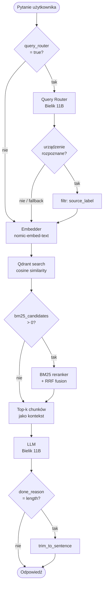

# bielik-runpod

REST API do uruchamiania polskiego modelu językowego **Bielik 11B v3.0** z obsługą RAG (Retrieval-Augmented Generation). Projekt jest zoptymalizowany pod RunPod z GPU RTX 4090, ale działa też lokalnie.

**Możliwości:**
- Generowanie odpowiedzi w języku polskim przez Bielik 11B
- RAG — odpowiedzi oparte na własnych dokumentach wgranych jako pliki XLSX
- Automatyczne chunkowanie i indeksowanie XLSX do bazy wektorowej Qdrant
- Query Router — model (Bielik 11B) identyfikuje urządzenie z pytania i filtruje Qdrant po `source_label`
- Wyszukiwanie semantyczne przez embeddingi `nomic-embed-text` z opcjonalnym rerankingiem BM25
- REST API z dokumentacją Swagger UI
- Narzędzia lokalne do budowania i ewaluacji golden setu (Recall@k, MRR, Accuracy routera)

**Ograniczenia:**
- Brak obsługi konwersacji — każde zapytanie jest niezależne; model nie pamięta poprzednich pytań ani odpowiedzi. Projekt działa wyłącznie w formule: pytanie → RAG → odpowiedź.
- Tylko XLSX — ingestion przyjmuje wyłącznie pliki XLSX. Projekt jest nastawiony na dane techniczne (mapy rejestrów, tabele parametrów), które wymagają precyzji przy chunkowaniu. Parsowanie PDF wprowadza szum (artefakty OCR, niejednoznaczne podziały stron, znaki specjalne), który zaburza tę precyzję i obniża jakość wyszukiwania.

**Stack:**
| Komponent | Rola |
|---|---|
| Bielik 11B v3.0 Q4_K_M | LLM — generowanie odpowiedzi |
| Bielik 11B v3.0 Q4_K_M | Query Router — identyfikacja urządzenia z pytania |
| nomic-embed-text | Embeddingi — wyszukiwanie semantyczne |
| Qdrant | Baza wektorowa |
| BM25 + RRF | Reranking kandydatów |
| FastAPI | REST API |
| Ollama | Serwer modeli |

Działa na RunPod oraz lokalnie.

---

## Pipeline RAG

Zapytanie użytkownika przechodzi przez cztery etapy:

1. **Query Router** (Bielik 11B, opcjonalny) — identyfikuje urządzenie z pytania na podstawie listy `source_label` pobranej z Qdrant. Jeśli rozpozna urządzenie, kolejne etapy przeszukują tylko jego chunki; jeśli nie — fallback do pełnej kolekcji.
2. **Embedder** (`nomic-embed-text`) — zamienia zapytanie na wektor i wyszukuje semantycznie podobne chunki w Qdrant (z filtrem `source_label` jeśli router zadziałał).
3. **BM25 reranker** (opcjonalny) — spośród kandydatów z etapu 2. reankuje przez dopasowanie słów kluczowych, łącząc oba rankingi metodą RRF (Reciprocal Rank Fusion). Ustawienie wysokiej liczby kandydatów (równej lub wyższej niż łączna liczba chunków w kolekcji) zamienia BM25 w symetryczny RRF — oba rankingi obejmują wtedy pełen zestaw dokumentów. Przy małej bazie chunków jest to korzystne, bo BM25 reankuje wszystkich kandydatów i nie pomija trafnych wyników.
4. **LLM** (Bielik 11B) — generuje odpowiedź na podstawie wybranych fragmentów jako kontekst. Jeśli odpowiedź została urwana przez limit tokenów (`done_reason == "length"`), pipeline przycina ją do ostatniego pełnego zdania (`.!?…`).

**Dlaczego same embeddingi nie wystarczają — wyzwanie terminów technicznych:**

Dokumenty z dziedziny automatyki przemysłowej są pełne symboli modeli, np. `OR-WE-520`, `SDM630`. Takie terminy stwarzają dwa niezależne problemy:

- **Embedder** uczy się reprezentacji semantycznych z dużych korpusów tekstu, w których symbole techniczne pojawiają się rzadko i bez kontekstu. Model słabo odróżnia `OR-WE-516` od `OR-WE-520` — oba wyglądają jak ciągi znaków o zbliżonej strukturze, więc ich wektory są do siebie podobne, choć dotyczą różnych urządzeń.
- **BM25** wymaga dokładnego dopasowania tokenów. Symbole techniczne zawierają separatory (myślniki, ukośniki, spacje). Użytkownik może wpisać ten sam symbol na różne sposoby: `OR-WE-520`, `ORWE520` lub samo `520` — każdy zapis powinien trafić na właściwy chunk.

Projekt rozwiązuje oba problemy: embeddingi zapewniają trafność semantyczną, a BM25 z wielopoziomową tokenizacją poprawia precyzję dla symboli technicznych.

**Tokenizacja BM25** działa wielopoziomowo, żeby symbol pasował niezależnie od tego, jak zostanie wpisany w zapytaniu:

1. Normalizacja: małe litery + usunięcie polskich diakrytyków (`Hasło` → `haslo`, `żółw` → `zolw`, `ł` → `l`).
2. Podział na segmenty alfanumeryczne — separatory są odrzucane (`OR-WE-520` → `["or", "we", "520"]`).
3. Każdy segment mieszający litery i cyfry jest dodatkowo rozbijany na części (`SDM630` → `["sdm", "630"]`, `3x230` → `["3", "x", "230"]`).
4. Gdy segmentów jest więcej niż jeden, do tokenów trafia też całe oryginalne słowo i konkatenacja segmentów (`OR-WE-520` → dodaje `"or-we-520"` i `"orwe520"`).
5. Tokeny jednoznakowe są odrzucane — eliminują szum z jednostek i skrótów (`"V"` z `400V`, `"x"` z `3x230`).

Przykłady:
```
"OR-WE-520"  → ["or", "we", "520", "or-we-520", "orwe520"]
"SDM630"     → ["sdm630", "sdm", "630"]
"3x230/400V" → ["3x230", "230", "400v", "400", "3x230/400v", "3x230400v"]
```

Dzięki temu zapytanie `"520"` trafi na chunk zawierający `"OR-WE-520"`, a zapytanie `"or-we-520"` dopasuje się zarówno przez całe słowo, jak i przez segmenty.

---

## Struktura repo

```
bielik-runpod/
├── api/
│   ├── __init__.py
│   ├── main.py           ← endpointy FastAPI + fabryki zależności (@lru_cache + Depends)
│   ├── config.py         ← stałe konfiguracyjne (MODEL, ROUTER_MODEL, EMBED_MODEL, prompty)
│   ├── schemas.py        ← modele Pydantic requestów i odpowiedzi API
│   ├── ollama_client.py  ← klient HTTP do Ollamy (embed, generate, pull, check)
│   ├── qdrant_store.py   ← operacje na kolekcjach i wektorach Qdrant (search, scroll)
│   ├── bm25_reranker.py  ← reranking kandydatów z Qdrant metodą BM25
│   ├── query_router.py   ← identyfikacja urządzenia z pytania przez model (Bielik 11B)
│   ├── rag_retriever.py  ← embed zapytania → search (z filtrem) → (BM25) → budowa kontekstu RAG
│   ├── ask_pipeline.py   ← orkiestracja: (router) → RAG → generowanie → metryki → AskResponse
│   ├── xlsx_ingester.py  ← walidacja, chunkowanie i indeksowanie plików XLSX
│   ├── xlsx_chunker.py   ← parsowanie XLSX na chunki tekstowe
│   └── requirements.txt
├── cli/
│   ├── cli_xlsx_chunker.py  ← podgląd chunków XLSX lokalnie (bez API)
│   └── cli_golden_set.py    ← generowanie golden setu do ewaluacji RAG
├── data/
│   ├── xlsx/                        ← przykładowe pliki XLSX z mapami rejestrów urządzeń (dane testowe)
│   ├── golden_sets/                 ← golden sety do ewaluacji RAG
│   └── reports/                     ← logi z ewaluacji
├── test/
│   ├── unit/                ← testy jednostkowe (pytest)
│   ├── integration/         ← testy integracyjne (wymagają Ollamy)
│   └── eval/                ← skrypty ewaluacyjne (golden set)
├── integrations/            ← gotowe integracje z zewnętrznymi systemami
│   └── wordpress-elementor/ ← plugin WordPress z widgetem Elementor
├── pytest.ini               ← konfiguracja pytest (testpaths, pythonpath)
└── start.sh                 ← skrypt startowy kontenera RunPod
```

---

## Uruchomienie

### Zmienne środowiskowe

Domyślne wartości zmiennych są dostosowane pod RunPod (kolumna „RunPod"). Przy uruchomieniu lokalnym `QDRANT_PATH` trzeba zawsze ustawić jawnie — domyślna ścieżka (`/root/data/qdrant`) nie istnieje lokalnie. `OLLAMA_MODELS` można opcjonalnie ustawić, żeby wybrać lokalizację modeli; jeśli pominiesz, Ollama użyje domyślnej lokalizacji ustalonej przez instalator.

| Zmienna | Opis | RunPod | Lokalne |
|---|---|---|---|
| `OLLAMA_URL` | Adres serwera Ollama | `http://localhost:11434` | ← |
| `OLLAMA_MODELS` | Katalog modeli Ollama (opcjonalne lokalnie) | `/root/data/ollama` | np. `C:\ollama-models` |
| `MODEL` | Model LLM do generowania odpowiedzi | `SpeakLeash/bielik-11b-v3.0-instruct:Q4_K_M` | ← |
| `EMBED_MODEL` | Model embeddingów do RAG | `nomic-embed-text` | ← |
| `QDRANT_PATH` | Ścieżka bazy wektorowej Qdrant (wymagane lokalnie) | `/root/data/qdrant` | np. `./data/qdrant` |

### Uruchomienie na RunPod

#### Tworzenie Template

**Manage → My Templates → New Template**

| Pole | Wartość |
|---|---|
| Template Name | `Bielik-11B-v3-Q4` |
| Container Image | `runpod/pytorch:2.8.0-py3.11-cuda12.8.1-cudnn-devel-ubuntu22.04` |
| Container Start Command | *(patrz niżej)* |
| Expose HTTP Ports | `8000` |
| Expose TCP Ports | `22` |
| Container Disk | `20 GB` |
| Volume Disk | `35 GB` |
| Volume Mount Path | `/root/data` |

**Container Start Command:**
```
bash -c "apt-get update && apt-get install -y curl git zstd && curl -fsSL https://ollama.com/install.sh | sh && rm -rf /tmp/init && git clone --depth=1 https://github.com/protechnologia/bielik-runpod /tmp/init && bash /tmp/init/start.sh"
```

#### Uruchamianie Poda

- **GPU:** RTX 4090
- **Cloud:** Secure Cloud (On Demand) — do prezentacji; Community Cloud — do testów
- **GPU Count:** 1

Pierwsze uruchomienie trwa ~8 minut (pobieranie modeli ~6.7 GB Bielik + ~274 MB nomic-embed-text na Volume).  
Kolejne uruchomienia ~2 minuty — modele już są na Volume.

#### Struktura Volume (`/root/data`)

Struktura wynikająca z domyślnych wartości zmiennych środowiskowych (`OLLAMA_MODELS`, `QDRANT_PATH`):

```
/root/data/
├── ollama/      ← modele Ollama (Bielik, nomic-embed-text)
└── qdrant/      ← baza wektorowa Qdrant (dokumenty RAG)
```

### Uruchomienie lokalne

**Wymagania (jednorazowo):**

1. Przygotuj miejsce na dysku:
   - **Ollama** — ~6.7 GB (Bielik 11B Q4_K_M) + ~274 MB (nomic-embed-text); lokalizację modeli kontroluje zmienna `OLLAMA_MODELS` (patrz krok 4)
   - **Qdrant** — zależy od liczby wgranych dokumentów; ścieżkę ustawia zmienna `QDRANT_PATH` (patrz krok 6)

2. Zainstaluj zależności Pythona:
```bash
pip install -r api/requirements.txt
```

3. Zainstaluj Ollama — pobierz installer ze strony [ollama.com](https://ollama.com/download) i uruchom.

4. Pobierz modele (odkomentuj `OLLAMA_MODELS` jeśli chcesz wybrać lokalizację — dostosuj ścieżkę):
```bash
# export OLLAMA_MODELS="/data/ollama"  # opcjonalne — dostosuj ścieżkę
ollama pull SpeakLeash/bielik-11b-v3.0-instruct:Q4_K_M
ollama pull nomic-embed-text
```

Na Windows (PowerShell):
```powershell
# $env:OLLAMA_MODELS="C:\ollama-models"  # opcjonalne — dostosuj ścieżkę
ollama pull SpeakLeash/bielik-11b-v3.0-instruct:Q4_K_M
ollama pull nomic-embed-text
```

**Uruchomienie:**

5. Uruchom Ollama (jeśli nie działa jako serwis):
```bash
# export OLLAMA_MODELS="/data/ollama"  # opcjonalne — ta sama ścieżka co w kroku 4
ollama serve
```

Na Windows (PowerShell):
```powershell
# $env:OLLAMA_MODELS="C:\ollama-models"  # opcjonalne — ta sama ścieżka co w kroku 4
ollama serve
```

6. Uruchom API:
```bash
# export OLLAMA_URL=http://localhost:11434  # opcjonalne — domyślnie http://localhost:11434
export QDRANT_PATH=./data/qdrant           # wymagane — domyślna ścieżka (/root/data/qdrant) nie działa lokalnie
export PYTHONPATH=.                        # wymagane — umożliwia import modułów z katalogu api/
uvicorn api.main:app --host 0.0.0.0 --port 8000
```

Na Windows (PowerShell):
```powershell
# $env:OLLAMA_URL="http://localhost:11434"  # opcjonalne — domyślnie http://localhost:11434
$env:QDRANT_PATH="./data/qdrant"           # wymagane — domyślna ścieżka (/root/data/qdrant) nie działa lokalnie
$env:PYTHONPATH="."                        # wymagane — umożliwia import modułów z katalogu api/
uvicorn api.main:app --host 0.0.0.0 --port 8000
```

API dostępne pod: `http://localhost:8000`  
Swagger UI: `http://localhost:8000/docs`

---

## Endpointy API

| Metoda | Endpoint | Opis |
|---|---|---|
| `GET` | `/health` | Status Ollamy, modeli i kolekcji Qdrant |
| `POST` | `/ask` | Generowanie odpowiedzi (opcjonalnie z RAG) |
| `POST` | `/ingest/xlsx` | Wgranie pliku XLSX — automatyczny chunking i zapis do Qdrant |
| `POST` | `/inspect/xlsx` | Wgranie pliku XLSX — podgląd chunków bez zapisu do Qdrant |
| `GET` | `/collections` | Lista kolekcji Qdrant z liczbą wektorów |
| `DELETE` | `/collections/{name}` | Usunięcie kolekcji |
| `GET` | `/models` | Lista modeli załadowanych w Ollama |
| `POST` | `/pull` | Pobranie modelu przez Ollama |

---

## Weryfikacja API

Baza URL:
- lokalnie: `http://localhost:8000`
- RunPod: `https://{POD_ID}-8000.proxy.runpod.net` (URL dostępny w panelu: **Connect → HTTP Service [Port 8000]**)

Poniższe przykłady używają adresu RunPod — zastąp go `http://localhost:8000` przy uruchomieniu lokalnym.

**Health check:**
```bash
curl https://{POD_ID}-8000.proxy.runpod.net/health
```

Przykładowa odpowiedź:
```json
{
  "status": "ok",
  "ollama": {
    "reachable": true,
    "model": "SpeakLeash/bielik-11b-v3.0-instruct:Q4_K_M",
    "model_ready": true,
    "embed_model": "nomic-embed-text",
    "embed_ready": true,
    "available_models": [
      "SpeakLeash/bielik-11b-v3.0-instruct:Q4_K_M",
      "nomic-embed-text:latest"
    ]
  },
  "qdrant": {
    "collections": ["documents"]
  }
}
```

**Zapytanie bez RAG:**
```bash
curl -X POST https://{POD_ID}-8000.proxy.runpod.net/ask \
  -H "Content-Type: application/json" \
  -d '{"prompt": "Czym jest spółdzielnia energetyczna? Odpowiedz w 2 zdaniach."}'
```

Przykładowa odpowiedź:
```json
{
  "answer": "Spółdzielnia energetyczna to...",
  "model": "SpeakLeash/bielik-11b-v3.0-instruct:Q4_K_M",
  "time_total_s": 12.1,
  "time_to_first_token_s": 1.3,
  "tokens_generated": 87,
  "tokens_per_second": 7.2,
  "rag_chunks_used": null,
  "rag_chunks": null
}
```

**Wgranie XLSX do bazy wektorowej:**
```bash
curl -X POST https://{POD_ID}-8000.proxy.runpod.net/ingest/xlsx \
  -F "file=@rejestry.xlsx" \
  -F "source_label=ORNO OR-WE-516" \
  -F "collection=documents" \
  -F "rows_per_chunk=50"
```

Przykładowa odpowiedź:
```json
{
  "filename": "rejestry.xlsx",
  "sheets": 2,
  "chunks": 6,
  "ingested": 6,
  "collection": "documents"
}
```

**Podgląd chunków XLSX (bez zapisu do bazy):**
```bash
curl -X POST https://{POD_ID}-8000.proxy.runpod.net/inspect/xlsx \
  -F "file=@rejestry.xlsx" \
  -F "source_label=ORNO OR-WE-516" \
  -F "rows_per_chunk=50"
```

Przykładowa odpowiedź:
```json
{
  "filename": "rejestry.xlsx",
  "sheets": 2,
  "chunks": 4,
  "items": [
    {
      "index": 1,
      "sheet": "Rejestry odczytu",
      "chunk": 1,
      "text": "ORNO OR-WE-516 / Rejestry odczytu\n\nAdres | Nazwa | ...",
      "char_count": 1842,
      "word_count": 312
    }
  ]
}
```

**Zapytanie z RAG i BM25:**
```bash
curl -X POST https://{POD_ID}-8000.proxy.runpod.net/ask \
  -H "Content-Type: application/json" \
  -d '{"prompt": "Jakie jest napięcie znamionowe licznika ORNO OR-WE-516?", "rag": true, "rag_top_k": 3, "rag_score_threshold": 0.3, "bm25_candidates": 20}'
```

**Zapytanie z RAG, BM25 i Query Routerem:**
```bash
curl -X POST https://{POD_ID}-8000.proxy.runpod.net/ask \
  -H "Content-Type: application/json" \
  -d '{"prompt": "Jakie jest napięcie znamionowe licznika ORNO OR-WE-516?", "rag": true, "rag_top_k": 3, "rag_score_threshold": 0.3, "bm25_candidates": 20, "query_router": true}'
```

Router identyfikuje urządzenie z pytania (Bielik 11B) i ogranicza wyszukiwanie Qdrant do chunków z pasującym `source_label`. Jeśli urządzenie nie zostanie rozpoznane, przeszukuje całą kolekcję.

Przykładowa odpowiedź `/ask` z RAG:
```json
{
  "answer": "Napięcie znamionowe licznika ORNO OR-WE-516 wynosi 3x230/400V.",
  "model": "SpeakLeash/bielik-11b-v3.0-instruct:Q4_K_M",
  "time_total_s": 14.2,
  "time_to_first_token_s": 1.5,
  "tokens_generated": 104,
  "tokens_per_second": 7.3,
  "rag_chunks_used": 2,
  "rag_chunks": [
    {
      "index": 1,
      "score": 0.8731,
      "source_label": "ORNO OR-WE-516",
      "sheet": "Rejestry odczytu",
      "text": "ORNO OR-WE-516 / Rejestry odczytu\n\nAdres | Nazwa | ..."
    }
  ]
}
```

**Lista kolekcji Qdrant:**
```bash
curl https://{POD_ID}-8000.proxy.runpod.net/collections
```

Przykładowa odpowiedź:
```json
[
  {"name": "documents", "vectors_count": 6}
]
```

**Usunięcie kolekcji:**
```bash
curl -X DELETE https://{POD_ID}-8000.proxy.runpod.net/collections/documents
```

Przykładowa odpowiedź:
```json
{"deleted": "documents"}
```

**Lista modeli Ollama:**
```bash
curl https://{POD_ID}-8000.proxy.runpod.net/models
```

Przykładowa odpowiedź:
```json
{
  "models": [
    {
      "name": "SpeakLeash/bielik-11b-v3.0-instruct:Q4_K_M",
      "size": 11800000000,
      "digest": "sha256:..."
    },
    {
      "name": "nomic-embed-text:latest",
      "size": 274000000,
      "digest": "sha256:..."
    }
  ]
}
```

**Pobranie modelu przez Ollama:**
```bash
curl -X POST https://{POD_ID}-8000.proxy.runpod.net/pull \
  -H "Content-Type: application/json" \
  -d '{"model": "nomic-embed-text"}'
```

Bez ciała requestu pobiera domyślny model generowania (z `config.MODEL`):
```bash
curl -X POST https://{POD_ID}-8000.proxy.runpod.net/pull
```

Przykładowa odpowiedź:
```json
{"status": "pulled", "model": "nomic-embed-text"}
```

Swagger UI: `https://{POD_ID}-8000.proxy.runpod.net/docs` (lokalnie: `http://localhost:8000/docs`)

---

## Narzędzia lokalne

### cli_xlsx_chunker.py

Skrypt CLI do lokalnego testowania chunkera bez uruchamiania API. Parsuje plik XLSX przez `XlsxChunker` i wyświetla wynik analogiczny do endpointu `/inspect/xlsx`.

```bash
python cli/cli_xlsx_chunker.py <plik.xlsx> <source_label> [--rows-per-chunk N]
```

Przykład:
```bash
python cli/cli_xlsx_chunker.py rejestry.xlsx "ORNO OR-WE-516" --rows-per-chunk 30
```


Przykładowy output:
```
════════════════════════════════════════════════════════════════════════
  Plik:          rejestry.xlsx
  Source label:  ORNO OR-WE-516
  Rows per chunk:30
  Arkusze:       2  (Rejestry odczytu, Rejestry zapisu)
  Chunków łącznie: 8
════════════════════════════════════════════════════════════════════════

────────────────────────────────────────────────────────────────────────
  Chunk #1  |  Arkusz: Rejestry odczytu  |  Część: 1
  Znaki: 1842   Słowa: 312
────────────────────────────────────────────────────────────────────────
ORNO OR-WE-516 / Rejestry odczytu

Adres | Nazwa | ...
--- | --- | ...
...

════════════════════════════════════════════════════════════════════════
  Podsumowanie: 8 chunków | 14736 znaków | 2496 słów
════════════════════════════════════════════════════════════════════════
```

### cli_golden_set.py

Skrypt CLI do budowania golden setu dla ewaluacji RAG. Ładuje jeden lub więcej plików XLSX, chunkuje je i zapisuje do JSON z pustą listą `prompts` do ręcznego lub AI wypełnienia.

```bash
python cli/cli_golden_set.py <plik1.xlsx> <etykieta1> [plik2.xlsx <etykieta2> ...] [--rows-per-chunk N] [--output FILE] [--seed N]
```

Przykład z jednym urządzeniem:
```bash
python cli/cli_golden_set.py "data/xlsx/ORNO OR-WE-520.xlsx" "ORNO OR-WE-520" --output data/golden_sets/golden_set.json
```

Przykład z dwoma urządzeniami (polecana forma — korpus lepiej testuje rozróżnianie urządzeń):
```bash
python cli/cli_golden_set.py \
  "data/xlsx/ORNO OR-WE-520.xlsx" "ORNO OR-WE-520" \
  "data/xlsx/EASTRON SDM630.xlsx" "EASTRON SDM630" \
  --output data/golden_sets/golden_set.json
```

Przykładowy output (`golden_set.json`):
```json
[
  {
    "chunk_id": 0,
    "source_label": "ORNO OR-WE-520",
    "prompts": [],
    "text": "ORNO OR-WE-520 / Rejestry odczytu\n\nAdres (hex) | Rejestr nr | ..."
  }
]
```

Pole `prompts` należy wypełnić listą pytań testowych (ręcznie lub przez AI), a następnie uruchomić ewaluator.

Projekt zawiera dwa gotowe golden sety w katalogu `data/golden_sets/`:
- `golden_set.json` — prompty realistyczne (5 na chunk): sformułowane tak jak użytkownik mógłby naprawdę zapytać, często bez nazwy urządzenia lub rejestru; mierzą jakość RAG w warunkach zbliżonych do produkcji
- `golden_set_unique.json` — prompty ukierunkowane na unikalność (2 na chunk): zawierają nazwę urządzenia, adres hex lub nazwę rejestru, które jednoznacznie wskazują na konkretny chunk; mierzą górną granicę możliwości embeddera — jeśli tu wynik jest słaby, problem leży w modelu lub chunkingu, nie w jakości pytań

---

## Testy

### Testy jednostkowe

110 testów jednostkowych pokrywających wszystkie klasy logiki biznesowej oraz warstwę HTTP (`main.py`). Nie wymagają działającej Ollamy ani Qdrant — zależności zewnętrzne są mockowane.

| Plik | Klasa | Testów | Pokrycie |
|---|---|---|---|
| `test_xlsx_chunker.py` | `XlsxChunker` | 11 | 100% |
| `test_bm25_reranker.py` | `Bm25Reranker` | 15 | 100% |
| `test_query_router.py` | `QueryRouter` | 10 | 100% |
| `test_xlsx_ingester.py` | `XlsxIngester` | 12 | 100% |
| `test_ollama_client.py` | `OllamaClient` | 14 | 100% |
| `test_qdrant_store.py` | `QdrantStore` | 13 | 100% |
| `test_rag_retriever.py` | `RagRetriever` | 9 | 100% |
| `test_ask_pipeline.py` | `AskPipeline` | 15 | 100% |
| `test_main.py` | endpointy FastAPI (`main.py`) | 11 | 100% |

Pokrycie: **100%** — logika biznesowa i warstwa HTTP. `test_main.py` używa `TestClient` z `dependency_overrides` (FastAPI DI), co stało się możliwe po refaktoryzacji `main.py` — zamiana globali na fabryki `@lru_cache` + `Depends()`.

```bash
pip install pytest
pytest -v
```

```
============================= test session starts =============================
platform win32 -- Python 3.10.5, pytest-9.0.3, pluggy-1.6.0
collected 110 items

test/unit/test_xlsx_chunker.py::test_load_sheets_basic PASSED            [  0%]
test/unit/test_xlsx_chunker.py::test_load_sheets_skips_empty PASSED      [  1%]
...
test/unit/test_main.py::test_list_collections PASSED                     [ 99%]
test/unit/test_main.py::test_delete_collection PASSED                    [100%]

============================== 110 passed in 3.19s ==============================
```

### Testy integracyjne

Plik `test/integration/test_integration.py` sprawdza współpracę prawdziwych komponentów — bez mockowania. Wymagają działającej Ollamy z modelem `nomic-embed-text`. Qdrant działa w trybie embedded (plik lokalny przez `qdrant-client`) — osobny serwer nie jest potrzebny.

Zakres testów:

| Grupa | Co jest sprawdzane |
|---|---|
| `OllamaClient` | `embed()` zwraca wektor 768 wymiarów; `check()` raportuje status modeli |
| `QdrantStore` | `ensure_collection` tworzy kolekcję; `upsert` + `search` zwraca wstawiony punkt; `scroll_source_labels` zwraca właściwą etykietę |
| `XlsxIngester` | pełny pipeline ingestion z syntetycznym XLSX: po `ingest()` kolekcja istnieje, `vectors_count` = liczba chunków, `scroll_source_labels` zawiera wstawiony `source_label` |
| `RagRetriever` | po ingestion `retrieve()` zwraca co najmniej jeden chunk; filtr `source_label` na inną etykietę zwraca `None` |

Każdy test tworzy własną kolekcję z losowym sufiksem i usuwa ją po zakończeniu — testy są izolowane i nie zostawiają danych w Qdrant.

Gdy `OLLAMA_URL` nie jest ustawiony, używany jest domyślny adres `http://localhost:11434`.

Wymagania: [Uruchomienie lokalne](#uruchomienie-lokalne) (Ollama + modele + zależności Pythona).

```bash
pytest test/integration/ -v
```

Na Windows (PowerShell):
```powershell
pytest test/integration/ -v
```

Dla zdalnej Ollamy (np. RunPod):
```powershell
$env:OLLAMA_URL="https://{POD_ID}-11434.proxy.runpod.net"; pytest test/integration/ -v
```

```
============================= test session starts =============================
platform win32 -- Python 3.10.5, pytest-9.0.3, pluggy-1.6.0
collected 9 items

test/integration/test_integration.py::test_embed_returns_768_dimensions PASSED       [ 11%]
test/integration/test_integration.py::test_check_embed_ready PASSED                  [ 22%]
test/integration/test_integration.py::test_qdrant_create_and_list_collection PASSED  [ 33%]
test/integration/test_integration.py::test_qdrant_upsert_and_search PASSED           [ 44%]
test/integration/test_integration.py::test_qdrant_scroll_source_labels PASSED        [ 55%]
test/integration/test_integration.py::test_ingest_vectors_count_matches_chunks PASSED [ 66%]
test/integration/test_integration.py::test_ingest_source_label_visible_in_scroll PASSED [ 77%]
test/integration/test_integration.py::test_retrieve_returns_chunk_after_ingest PASSED [ 88%]
test/integration/test_integration.py::test_retrieve_wrong_source_label_returns_none PASSED [100%]

============================== 9 passed in 9.61s ==============================
```

### Ewaluacja retrievera

Skrypt `test/eval/eval_retriever.py` mierzy jakość retrievera na golden secie — bez Qdrant, wyłącznie przez porównanie cosinusowe wektorów z opcjonalnym rerankingiem BM25 i opcjonalnym query routerem. Wyniki: Recall@1, Recall@2, Recall@3 i MRR.

Tryby pracy:
- `--bm25-candidates 0` — sam embedder (porównanie cosinusowe)
- `--bm25-candidates 20` — embedder + reranking BM25 (domyślnie)
- `--query-router` — query router (Bielik 11B) zawęża corpus przed obliczeniem rankingów
- `--bm25-candidates 20 --query-router` — wszystkie trzy etapy razem

Działa na CPU — `nomic-embed-text` (~274 MB) nie wymaga GPU. Embedowanie będzie wolniejsze niż na karcie graficznej (kilka sekund na tekst), ale przy małym golden secie czas jest do przyjęcia.

Wymagania: [Uruchomienie lokalne](#uruchomienie-lokalne) (Ollama + `nomic-embed-text` + zależności Pythona).

```bash
python test/eval/eval_retriever.py data/golden_sets/golden_set.json
```

Na obu golden setach:
```bash
python test/eval/eval_retriever.py data/golden_sets/golden_set.json
python test/eval/eval_retriever.py data/golden_sets/golden_set_unique.json
```

Opcjonalnie — wyłączony BM25, query router, wyższe k, tryb szczegółowy lub zdalny Pod:
```bash
python test/eval/eval_retriever.py data/golden_sets/golden_set.json --bm25-candidates 0
python test/eval/eval_retriever.py data/golden_sets/golden_set.json --query-router
python test/eval/eval_retriever.py data/golden_sets/golden_set.json --bm25-candidates 20 --query-router --verbose
python test/eval/eval_retriever.py data/golden_sets/golden_set.json --k 6
python test/eval/eval_retriever.py data/golden_sets/golden_set.json --verbose
python test/eval/eval_retriever.py data/golden_sets/golden_set.json --ollama-url https://{POD_ID}-11434.proxy.runpod.net
```

Przykładowy output (6 chunków — ORNO OR-WE-520 + EASTRON SDM630):
```
Embedowanie 6 chunków...
  [1/6] chunk_id=0
  ...
  [6/6] chunk_id=5

Ewaluacja (embedder + BM25 (kandydaci: 20))...

══════════════════════════════════════════════════
  Chunków:             6
  Par (prompt, chunk): 30
  BM25 kandydaci:      20
  Recall@1:            0.700  (21/30)
  Recall@2:            0.867  (26/30)
  Recall@3:            0.933  (28/30)
  MRR:                 0.789
══════════════════════════════════════════════════
```

Przykładowy output z `--verbose`:
```
  ✓ [1] "napięcie L1 rejestr ORNO OR-WE-516"
       #1 chunk_id=0  (cosine: 0.8321) ← poprawny
       #2 chunk_id=2  (cosine: 0.7102)
       #3 chunk_id=1  (cosine: 0.6891)
  ✗ [2] "reset licznika OR-WE-520"
       #1 chunk_id=0  (cosine: 0.8120)
       #2 chunk_id=1  (cosine: 0.7240) ← poprawny
       #3 chunk_id=2  (cosine: 0.6510)
```

### Ewaluacja Query Routera

Skrypt `test/eval/eval_query_router.py` mierzy samodzielną jakość Query Routera (Bielik 11B) — dla każdego prompta w golden secie sprawdza, czy router poprawnie identyfikuje urządzenie. Wyniki: Accuracy, trafienia, fallbacki (brak odpowiedzi), błędy (zły label).

Wymagania: [Uruchomienie lokalne](#uruchomienie-lokalne) (Ollama + `bielik-11b-v3.0-instruct:Q4_K_M` + zależności Pythona). Wymaga GPU — Bielik 11B na CPU będzie bardzo wolny.

```bash
python test/eval/eval_query_router.py data/golden_sets/golden_set.json
```

Opcjonalnie — inny model, tryb szczegółowy lub zdalny Pod:
```bash
python test/eval/eval_query_router.py data/golden_sets/golden_set.json --verbose
python test/eval/eval_query_router.py data/golden_sets/golden_set.json --router-model SpeakLeash/bielik-4.5b-v3.0-instruct:Q4_K_M
python test/eval/eval_query_router.py data/golden_sets/golden_set.json --router-model SpeakLeash/bielik-11b-v3.0-instruct:Q4_K_M --verbose
python test/eval/eval_query_router.py data/golden_sets/golden_set.json --ollama-url https://{POD_ID}-11434.proxy.runpod.net
```

Przykładowy output:
```
Model routera:  SpeakLeash/bielik-11b-v3.0-instruct:Q4_K_M
Urządzenia:     ['EASTRON SDM630', 'ORNO OR-WE-520']
Chunków:        6
Par (prompt, chunk): 30
  [1/30] "energia bierna taryfa t1 t2 or-we-520 adres hex"
  ...
══════════════════════════════════════════════════
  Model routera:       SpeakLeash/bielik-11b-v3.0-instruct:Q4_K_M
  Urządzenia:          2  (EASTRON SDM630, ORNO OR-WE-520)
  Par (prompt, chunk): 30
  Trafień:             27/30  (90.0%)
  Fallback (brak):     2/30  (6.7%)
  Błędów:              1/30  (3.3%)
  Accuracy:            0.900
══════════════════════════════════════════════════

──────────────────────────────────────────────────
  PROMPT DO LLM (pierwsze zapytanie)
──────────────────────────────────────────────────
[SYSTEM]
Masz listę urządzeń. Twoim zadaniem jest określić, którego urządzenia dotyczy pytanie użytkownika.

Zasady:
1. Szukaj w pytaniu nazwy urządzenia lub jej fragmentu.
2. Jeśli znajdziesz dopasowanie — odpowiedz DOKŁADNIE nazwą z listy, bez żadnych zmian.
3. Jeśli pytanie nie dotyczy żadnego konkretnego urządzenia z listy — odpowiedz: brak
4. Nie dodawaj żadnych innych słów, wyjaśnień ani znaków interpunkcyjnych.

[USER]
Dostępne urządzenia:
- EASTRON SDM630
- ORNO OR-WE-520

Pytanie: energia bierna taryfa t1 t2 or-we-520 adres hex
──────────────────────────────────────────────────
```

Blok `PROMPT DO LLM` jest wyświetlany zawsze — niezależnie od flagi `--verbose`. Pozwala szybko sprawdzić, czy lista urządzeń i pytanie, które trafiają do małego modelu, wyglądają poprawnie.

---

## Wyniki testów

### Query Router

| Metryka                  | Bielik 11B Q8 | Bielik 11B Q4_K_M |
|:-------------------------|:----------------|:------------------|
| Trafień                  | 120/135         | 128/135           |
| Fallback (brak)          | 15/135          | 6/135             |
| Błędów (złe urządzenie)  | 0/135           | 1/135             |
| **Accuracy**             | **88.9%**       | **94.8%**         |

Najważniejsza metryka to **brak błędów** (0 złych urządzeń). Błąd routera — wskazanie nieprawidłowego urządzenia — jest gorszy niż fallback: retriever przeszukuje wtedy wyłącznie chunki błędnie wskazanego urządzenia, co gwarantuje pominięcie właściwego wyniku bez względu na jakość embeddera. Fallback (brak rozpoznania) uruchamia wyszukiwanie po całej kolekcji, więc retriever nadal ma szansę odnaleźć właściwy chunk. W drugiej kolejności zależy nam na jak najwyższej liczbie trafień — im rzadziej router odpada do fallbacku, tym mniejszy corpus przeszukuje embedder i tym precyzyjniejszy wynik.

### Retriever

| Metryka    | EMBED+BM25@20   | EMBED+BM25@100      | ROU+EMB+BM25@100        |
|:-----------|:----------------|:--------------------|:------------------------|
| Recall@1   | 0.422 (57/135)  | 0.444 (60/135)      | **0.541** (73/135)      |
| Recall@2   | 0.563 (76/135)  | 0.585 (79/135)      | **0.896** (121/135)     |
| Recall@3   | 0.659 (89/135)  | 0.689 (93/135)      | **0.963** (130/135)     |
| Recall@4   | 0.689 (93/135)  | 0.741 (100/135)     | **0.985** (133/135)     |
| Recall@5   | 0.733 (99/135)  | 0.807 (109/135)     | **0.993** (134/135)     |
| Recall@6   | 0.807 (109/135) | 0.852 (115/135)     | **0.993** (134/135)     |
| Recall@7   | 0.837 (113/135) | 0.889 (120/135)     | **1.000** (135/135)     |
| Recall@8   | 0.859 (116/135) | 0.911 (123/135)     | **1.000** (135/135)     |
| Recall@9   | 0.867 (117/135) | 0.941 (127/135)     | **1.000** (135/135)     |
| Recall@10  | 0.867 (117/135) | 0.985 (133/135)     | **1.000** (135/135)     |
| **MRR**    | 0.567           | 0.600               | **0.749**               |

**MRR** (Mean Reciprocal Rank) to średnia z odwrotności pozycji pierwszego trafienia — dla każdego pytania liczymy 1/rank, gdzie rank to pozycja właściwego chunku na liście wyników (1, 2, 3, ...). Przykłady: MRR = 1.0 — właściwy chunk zawsze pierwszy; MRR = 0.75 — przeciętnie między pozycją 1 a 2 (np. połowa pytań na #1, połowa na #2 daje dokładnie 0.75); MRR = 0.567 (nasz wynik EMBED+BM25@20) — właściwy chunk trafia na pierwszą pozycję w ~57% przypadków, na drugą w kolejnych ~15%, reszta dalej; MRR = 0.5 — przeciętnie druga pozycja; MRR = 0.33 — przeciętnie trzecia pozycja. Metryka jest wrażliwa na pozycję pierwszego trafienia i ignoruje kolejność pozostałych wyników — istotna gdy model dostaje do kontekstu tylko top-1 lub top-2 chunki.

Query router ma największy wpływ na wyniki — sam wzrost puli kandydatów BM25 z 20 do 100 poprawia Recall@1 zaledwie o 2 pp., natomiast dołączenie routera przy @100 daje skok o prawie 10 pp. (0.444 → 0.541) i dramatycznie poprawia wyniki przy wyższych k (Recall@2: 0.585 → 0.896, Recall@7: 0.889 → 1.000). Intuicja jest prosta: router zawęża corpus do jednego urządzenia, więc embedder nie musi konkurować z semantycznie podobnymi chunkami z innych urządzeń. Słaby punkt to Recall@1 nawet z routerem (0.541) — właściwy chunk nie zawsze trafia na pierwszą pozycję, co uzasadnia ustawienie `rag_top_k` na 3–5 w produkcji.

---

## Integracje

### WordPress + Elementor (`integrations/wordpress-elementor/`)

Plugin WordPress (`bielik-rag-widget`) dodaje widget Elementor z interfejsem Q&A — użytkownik wpisuje pytanie, widget wysyła je do API Bielika i wyświetla odpowiedź wraz ze statystykami wydajności (czas odpowiedzi, tokeny/s) oraz fragmentami RAG jako klikalne przyciski otwierające modal z pełnym tekstem chunku.

**Architektura:**
- Parametry połączenia (URL API, token Bearer, nazwa kolekcji Qdrant, parametry RAG) konfigurowane w panelu WordPress (Ustawienia → Bielik RAG) — token nigdy nie opuszcza serwera PHP.
- Kontrolki Elementora obejmują wyłącznie warstwę prezentacji: tytuł, placeholder, kolory, typografia.
- PHP proxy (`class-rest-proxy.php`) pośredniczy między przeglądarką a FastAPI — przeglądarka wysyła tylko `{ prompt }`, proxy dołącza wszystkie parametry RAG z `wp_options`.
- Widget obsługuje wiele instancji na jednej stronie (unikalne ID z `$this->get_id()`).

**Instalacja:** wgraj `bielik-rag-widget.zip` przez WordPress → Wtyczki → Dodaj nową → Wyślij wtyczkę.

---

## TODO

### Jakość RAG
- [ ] **FuzzyRouter** (rapidfuzz) — alternatywa dla routera LLM. Obecny `QueryRouter` wysyła zapytanie do Bielika 11B, żeby rozpoznał nazwę urządzenia — to ~1–2 sekundy opóźnienia na każde pytanie. FuzzyRouter porównałby zapytanie z listą `source_label` przez dopasowanie rozmyte (Levenshtein / token sort ratio), bez żadnego wywołania modelu. Szybszy o rząd wielkości, deterministyczny, nie wymaga GPU. Wadą jest brak rozumienia kontekstu — "licznik trójfazowy Orno" może nie dopasować się do "ORNO OR-WE-520", podczas gdy Bielik sobie z tym radzi.
- [ ] **Lepszy model embeddingów** (np. `multilingual-e5-large`) — `nomic-embed-text` ma 768 wymiarów i dobry angielski, ale słabiej rozumie polskie konstrukcje techniczne. `multilingual-e5-large` (1024 wymiary, trenowany na 100+ językach) powinien dawać wyższe podobieństwo cosinusowe między polskim pytaniem a polskim fragmentem dokumentacji. Spodziewany efekt: wzrost Recall@1 i MRR w ewaluacji, szczególnie przy pytaniach z polską terminologią.
- [ ] **HyDE** (Hypothetical Document Embeddings) — zamiast embedować surowe pytanie użytkownika ("Jakie jest napięcie znamionowe?"), model najpierw generuje hipotetyczną odpowiedź ("Napięcie znamionowe wynosi 3×230/400V, częstotliwość 50Hz..."), a jej embedding trafia do Qdrant. Embedding hipotetycznej odpowiedzi jest bliższy przestrzeni wektorowej dokumentacji niż embedding pytania — co przekłada się na trafniejsze wyniki wyszukiwania. Koszt: dodatkowe wywołanie LLM przed każdym retrieve.
### Architektura i produkcyjność
- [ ] **Nowe pola w odpowiedzi `/ask`** — dodać `routed_device` (rozpoznana przez Query Router nazwa urządzenia lub `"brak"`) oraz `qdrant_chunks` (liczba chunków z Qdrant przed rerankiem cosinus+BM25), analogicznie do istniejącego `rag_chunks_used`.
- [ ] **Limit znaków w XlsxChunker** (`max_chars`) — szerokie tabele XLSX (np. 10 kolumn × 50 wierszy) mogą przekroczyć limit kontekstu `nomic-embed-text` (2048 tokenów); chunker powinien przycinać tekst i logować ostrzeżenie.
- [ ] Asynchroniczny ingest + endpoint `/tasks/{id}` ze statusem — przy dużych plikach embedding sekwencyjny będzie wolny
- [ ] Autoryzacja — API key
- [ ] Obsługa duplikatów przy ponownym wgraniu tego samego pliku
- [ ] Globalny exception handler w FastAPI — `/ingest/xlsx` przy uszkodzonym pliku rzuca 500 zamiast czytelnego 422
- [ ] Prosty frontend

### Testy i infrastruktura
- [ ] Reset `lru_cache` w fixture `test_main.py` — jeśli test wywoła prawdziwą fabrykę (brak override), kolejne testy dostaną tę samą zepsutą instancję z cache'a; fikstura powinna czyścić cache po każdym teście

---

## Diagram pipeline

